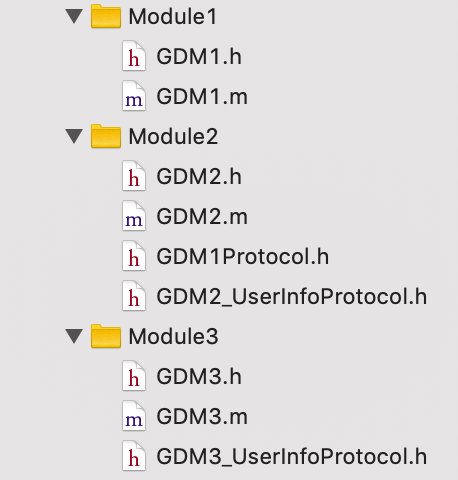
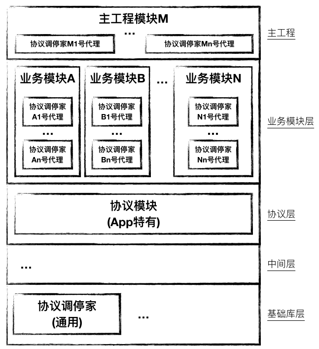

# 模块块化解耦调用之协议中介者方案(1.0+2.0)

## 稿定调停家 ([GDProtocoMediator](https://github.com/Quanhua-Guan/GDProtocolMediator)) 版本: 1.0

## 思路:

- 基于协议，定义各个模块提供的功能接口.(***面相协议编程***)
- 各个模块依照统一的规定提供**获取协议实现者**的实现, 实现自注册.
  - 此模块(严格的说是此模块中的一个类)相当于是GDProtocolMediator的一个代理者, 实现了GDProtocolMediatorProtocol协议.
    - [见下图]比如协议GDM1Protocol在模块Module1中实现, 而在GDM1.m中实现了类GDM1ProtocolMediator以及+implementor类方法. 可以参考[具体代码](https://github.com/Quanhua-Guan/GDProtocolMediator/blob/master/Example/GDProtocolMediator/Module1/GDM1.m).
- 调用者通过GDProtocolMediator获取某个协议的实现者, 使用协议实现者直接调用对应的协议方法.

# 模块依赖结构图

- GDProtocolMediator位于基础库层, 属于通用库.
- **协议模块**位于中间层(GDMModel)和业务模块层之间, 注意**协议层**不需要依赖**协议中介者**.
- 所有**业务模块**依赖**协议层**.

------

# 稿定调停家 2.0 说明

## 一. 兼容版本1.0 

## 二. 思路

- 业务模块分为接口**调用者**和接口**实现者**, **约定**一个功能在某个业务模块只能提供一个对外接口, 所以调用者和实现者可能是多对一的关系**.**
- 调用者和实现者双方共同**约定接口**, 实现者需要产出相应文档, 而调用者也需要在对应业务模块的文档中添加调用了相关接口的说明. 
  - 实现者有义务识别不同调用者提出的相似需求, 并对接口进行整合, 避免冗余接口的产生.
- 不使用统一的协议层, 解除由于各个业务模块对协议层的依赖而产生的耦合.
  - 提供者负责实现约定好的接口(注意, 提供者不依赖一个协议的**.h**头文件).
  - 调用者在自己模块内创建对应的接口**.h**头文件, 协议名命名格式为: **模块名_XxProtocol**, 例如: GDM1_UserInfoProtocol, GDM2_UserInfoProtocol, GDM3_UserInfoProtocol. (此处下划线之后部分字符串为协议名称, 与提供者实现的**稿定调停家<u>代理</u>**对应).
  - 调用者将协议名称传递给稿定调停家, 由稿定调停家获取对应的协议实现者, 然后调用者将该实现者**强转**为实现对应协议的对象, 这样就可以愉快的调用相关的接口方法了.

## 三. 优势

- 支持并行开发, 对于定接口时只涉及到调用方和实现者, 而且相关的改动也被限制在这两者对应的业务模块, 不需要修改一个共同的底层模块.

## 四. 问题

- 协议名是约定的, 在实现者对应的模块中是不存在该协议的**.h**头文件的, 调用方则有, 所以调用方与实现者在协议名上可能会产生不一致(这里和使用字符串带来的问题类似).
  
  - 这个问题几乎不影响调用方的编码体验, 因为调用者自己定义相应的接口头文件. 只会在协议名的下划线后面部分写错了之后产生不一致错误.
  
    

## 参考

- [CTMediator](https://github.com/casatwy/CTMediator): 基于runtime这个天然的中介者.
- [BeeHive](https://github.com/alibaba/BeeHive): 面向协议(Protocol)搞事情.

